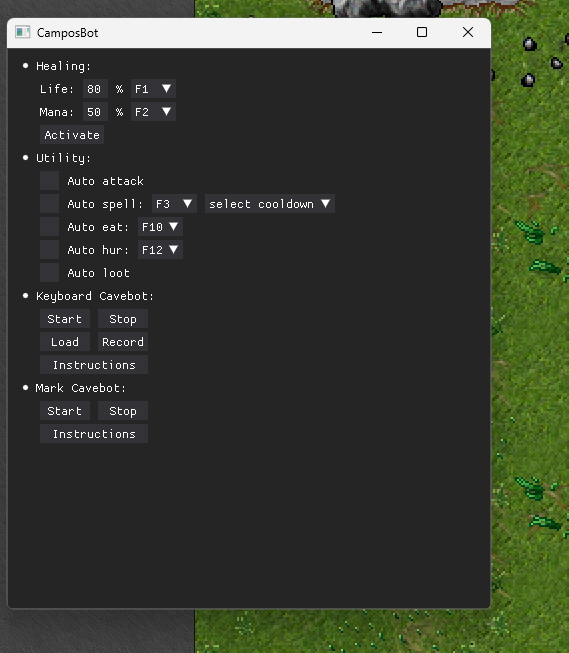

<h1>Tibia bot (Beta)</h1>
<b>Some functions still not 100% and may have some bugs!</b>

This program aims to automate functions in the Tibia game, such as:  
<ul>
  <li>Autoloot</li>
  <li>Autoheal</li>
  <li>Autoattack</li>
  <li>Autospells</li>
  <li>Autohur</li>
  <li>Autoeat</li>
  <li>Hunting</li>
</ul>

The bot works based on reading pixels on the screen from screenshots and after that, make some actions in your character.  
For example: 
- When your healthbar is less than 80%, use a healing spell
